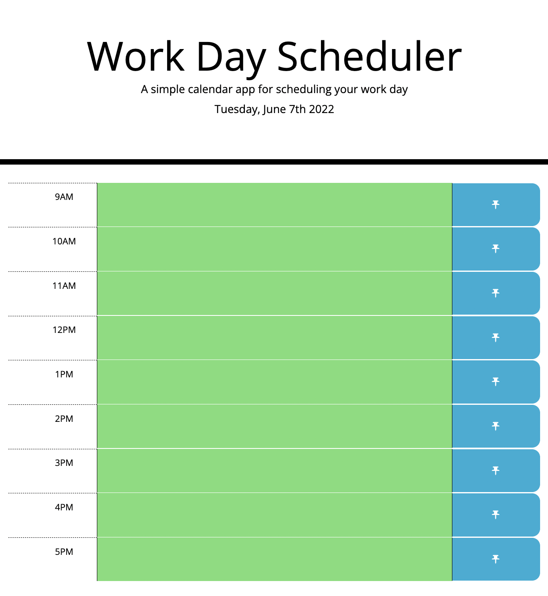

# Work Day Scheduler Starter Code

## Description

- The Work Day Scheduler repository was created to build a customizable and persisting daily schedule for personal use.
- This project was created to strengthen my proficiency working with third-parrt APIs including jQuery in tandem with Javascript for coding out the functionality, and Bootstrap to style the page layout. 
- The Work Day Scheduler application can be used to help plan out your day and monitor progress throughout the day due to its color coding feature that tells you which events have passed, which are currently happening and what is in the future. You may also update your schedule throughout if plans are changed.
- Creating the Work Day Scheduler provided considerable opportunities to troubleshoot and debug code, utlilize the 3rd-party Web APIs and pracice executing proper JavaScript and jQuery syntax.

### Page Preview

### Link to Application

[View in browser](https://katiebutler37.github.io/work-day-scheduler/)